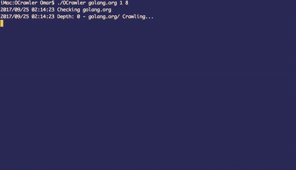

# OCrawler

---

A small Crawler Written in Go to retrieve the Site Map of any domain

Why O? Just because my name starts with O, nothing special 😊.

### Prerequisites

* Go 1.8^

* github.com/beego/bee/logger/colors

...Adds colour to the output of the program

* golang.org/x/net/html
...Parses HTML documents

### Installation

To download and install the libraries just type on the CLI

```
$ go get github.com/beego/bee/logger/colors
$ go get golang.org/x/net/html
```

Don't forget to setup your GOPATH environment variable!

### Build

To build the source code go to the working directory and just type

```
$ go build
```

This will generate the executable file

### Run

To run simply execute the file that was generated after the build in this case OCrawler

The first variable is the domain to crawl, without http/https at the beginning and without any URI, even without a single slash /

The second variable is the maximum depth on when crawling, this will set a threshold on how many levels more want to crawl, a good number should be 1 or 2.

The third variable is how many processes you want to have alive at the same time while the execution is in progress.
A good rule of thumb is to use the number of threads your computer has.

```
$ ./OCrawler [domain] [depth] [max processes]
$ ./OCrawler golang.org 2 8
```

### Output

The tree has 3 main colours

* Blue: new discovered links
* Magenta: Already discovered links
* Green: Assets

<div style="text-align:center"></div>

---

Developed by Omar Contreras [omarch7@gmail.com](mailto:omarch7@gmail.com)
